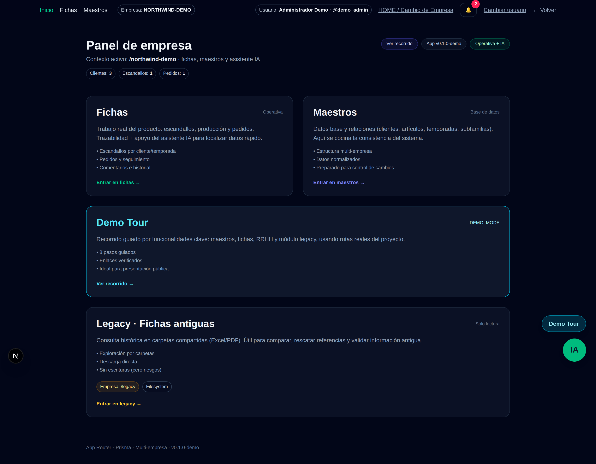
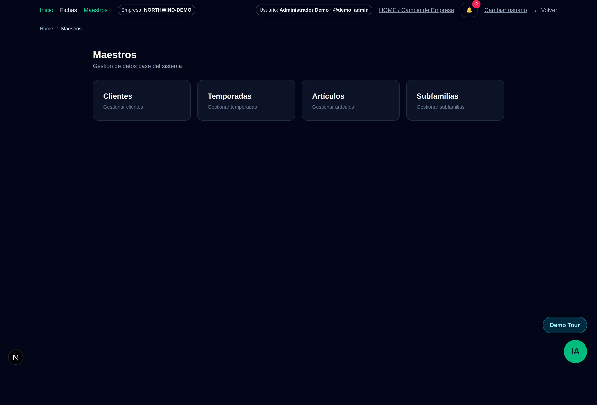
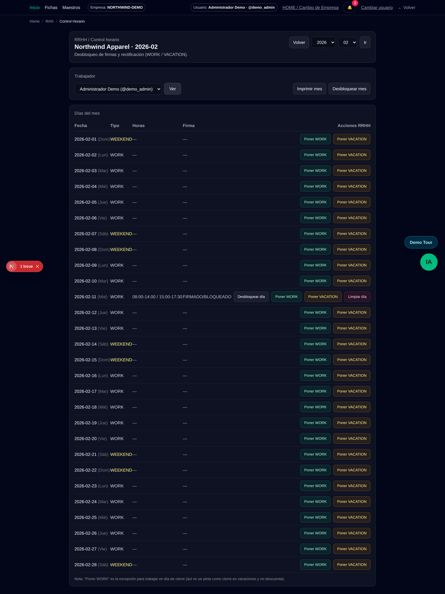
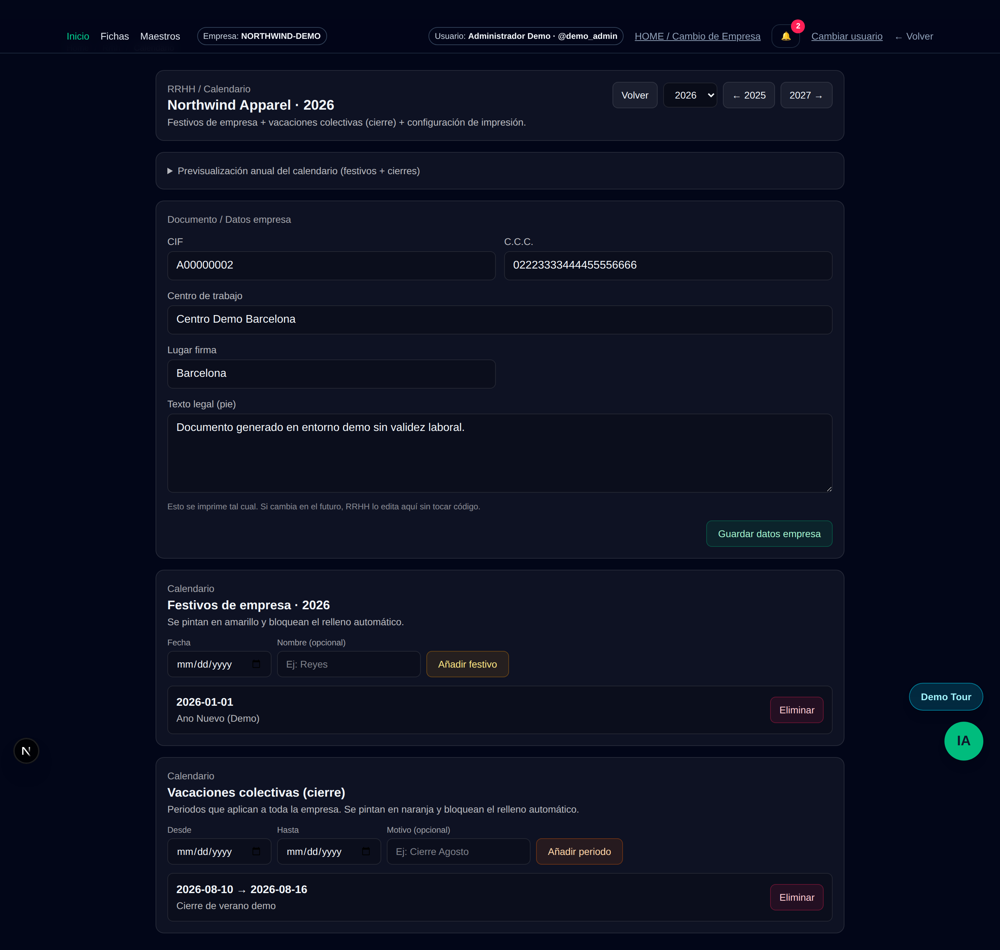
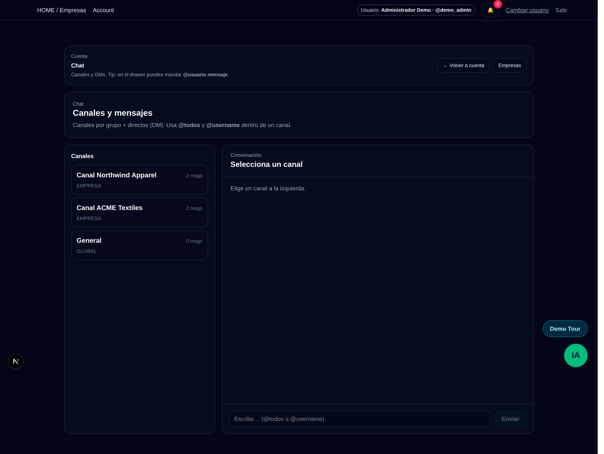
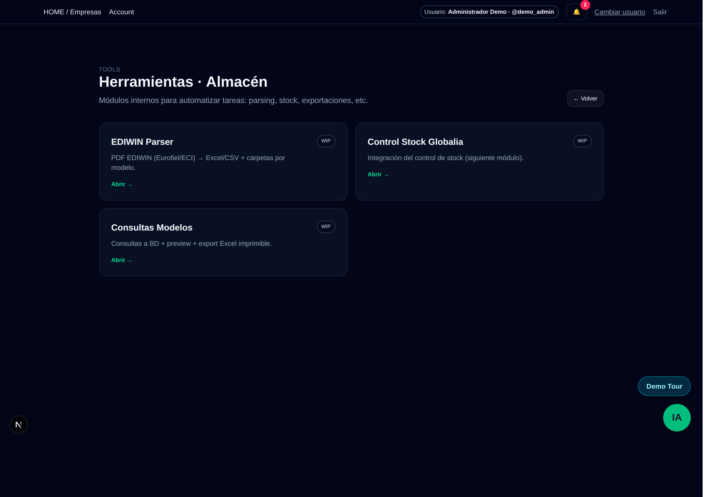
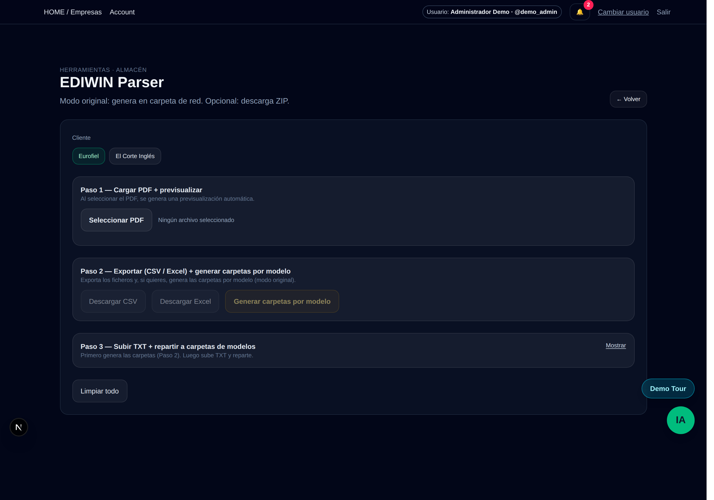
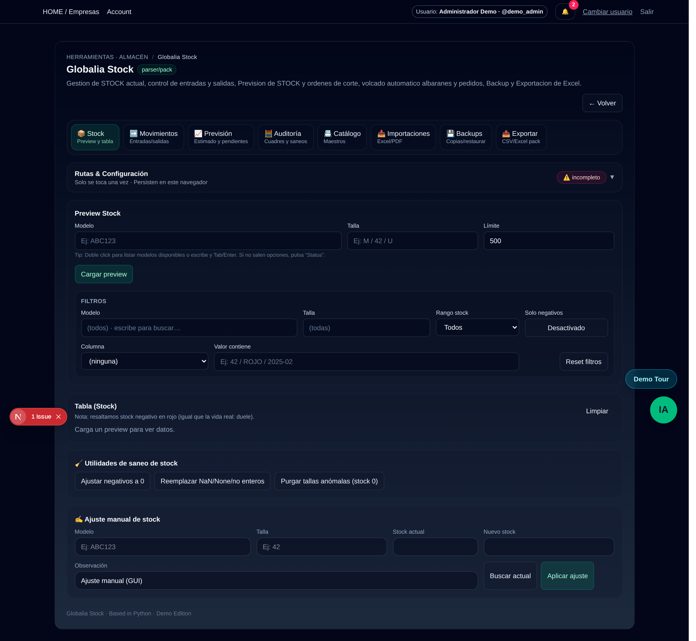

# SaaS Gestion - Public Demo

Demo publicable de una plataforma interna de gestion textil (multi-empresa) con foco en:

- clientes y articulos
- escandallos y pedidos
- stock e integraciones de almacen
- RRHH (fichajes y vacaciones)
- chat interno, notificaciones y asistente IA

- ⚠️ Este repositorio es una recreación demo con datos sintéticos.
- La aplicación de producción se ejecuta en entorno privado y no comparte datos reales, infraestructura ni credenciales.

## Features principales

- Multi-tenant con 2 empresas demo.
- Maestros: clientes, articulos, temporadas, subfamilias.
- Flujo producto: escandallo -> pedido -> almacen/control.
- RRHH: control horario, festivos, vacaciones y saldo anual.
- Chat interno y notificaciones in-app.
- Asistente IA con herramientas deterministas y fallback demo.
- Integraciones EDIWIN/Globalia con soporte mock en `DEMO_MODE`.

## Screenshots















> Para regenerarlas: `cd webapp-excel && DEMO_TOUR_EMPRESA=northwind-demo npm run screenshots`

## Credenciales demo

Password comun por defecto: `demo1234`
Estas credenciales son publicas y solo validas para la demo local (sin acceso a sistemas reales).

- `demo_admin` (`admin.demo@example.com`)
- `demo_rrhh` (`rrhh.demo@example.com`)
- `demo_almacen` (`almacen.demo@example.com`)

## Tour recomendado

1. Home -> empresa `acme-demo`.
2. Maestros -> Clientes / Articulos.
3. Fichas -> Escandallo demo y Pedido demo.
4. RRHH -> Control horario y Vacaciones.
5. Chat -> canal global y canal empresa.
6. Tools -> Globalia Stock y EDIWIN (mock en demo mode).

## Stack

- Next.js (App Router), React, TypeScript
- Prisma ORM + PostgreSQL
- NextAuth (credentials)
- Socket.IO realtime (servicio `realtime`)
- Python tools para integraciones (modo real o mock)

## Lo que demuestra este proyecto

- Arquitectura multi-tenant real (empresa en ruta y filtrado por `empresaId`).
- Control de permisos por rol (admin / rrhh / almacen).
- Migraciones versionadas y base de datos reproducible con seed demo.
- Integraciones desacopladas con soporte `DEMO_MODE` (mocks controlados).
- Separación de servicios (app web + realtime server).
- Buenas prácticas de publicación: `.env.example`, auditoría de sanitización, documentación técnica.

## Instalacion rapida

```bash
# 1) Dependencias
cd webapp-excel && npm install
cd ../realtime && npm install

# 2) Variables de entorno
cp webapp-excel/.env.example webapp-excel/.env
cp realtime/.env.example realtime/.env

# 3) Base de datos
# Levanta Postgres (ej. docker compose en raiz)
docker compose up -d db

# 4) Migrar + seed demo
cd webapp-excel
npx prisma migrate deploy
npm run db:seed

# 5) Ejecutar
# terminal 1
cd realtime && npm start
# terminal 2
cd webapp-excel && npm run dev
```

## Scripts

En `webapp-excel`:

- `npm run dev`
- `npm run build`
- `npm run start`
- `npm run lint`
- `npm run db:seed`
- `npm run demo-reset`

## Estructura

- `webapp-excel/`: app principal
- `realtime/`: servicio websocket
- `data/`: datasets demo de integraciones
- `docs/`: documentacion tecnica y operativa
- `SANITIZATION_REPORT.md`: auditoria de limpieza

## Seguridad y sanitizacion

- Variables sensibles reemplazadas por placeholders.
- Datasets reales reemplazados por contenido sintetico.
- Uploads, backups y binarios sensibles eliminados.
- Modo demo (`DEMO_MODE=true`) para mocks de integraciones.

Mas detalle: `docs/SECURITY.md` y `SANITIZATION_REPORT.md`.

## Licencia

MIT (`LICENSE`).

## Contribucion

Ver `CONTRIBUTING.md`.
